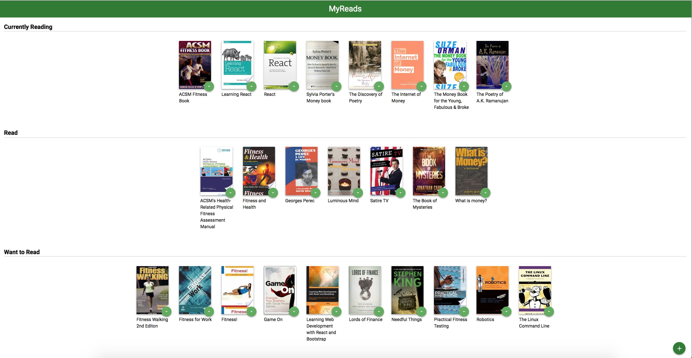

# MyReads Project

MyReads is a bookshelf app that allows the user to select and categorize books they have read, are currently reading, or want to read. This is an application created with ReactJS. This projects demonstrates the understanding of props, states, Components, JSX, AJAX, and JavaScript(ECMAScript) 6.



## Getting Started
These instructions will get you a copy of the project up and running on your local machine for development and testing
purposes.

### Prerequisites
Project can be built using npm or yarn. Install npm or yarn if you don't have any installed on your system.

### Installing

To download the project
```
git clone https://github.com/manvigupta1987/webDev/tree/book-tracking-app-react
cd book-tracking-app-react/reactnd-project-myreads-starter
```

Install dependencies and run with:
```
npm install
npm start
```
This will start the app in the default browser at localhost:3000


## Backend Server

To simplify your development process, we've provided a backend server for you to develop against. The provided file [`BooksAPI.js`](src/BooksAPI.js) contains the methods you will need to perform necessary operations on the backend:

* [`getAll`](#getall)
* [`update`](#update)
* [`search`](#search)

### `getAll`

Method Signature:

```js
getAll()
```

* Returns a Promise which resolves to a JSON object containing a collection of book objects.
* This collection represents the books currently in the bookshelves in your app.

### `update`

Method Signature:

```js
update(book, shelf)
```

* book: `<Object>` containing at minimum an `id` attribute
* shelf: `<String>` contains one of ["wantToRead", "currentlyReading", "read"]
* Returns a Promise which resolves to a JSON object containing the response data of the POST request

### `search`

Method Signature:

```js
search(query)
```

* query: `<String>`
* Returns a Promise which resolves to a JSON object containing a collection of a maximum of 20 book objects.
* These books do not know which shelf they are on. They are raw results only. You'll need to make sure that books have the correct state while on the search page.

## Important
The backend API uses a fixed set of cached search results and is limited to a particular set of search terms, which can be found in [SEARCH_TERMS.md](SEARCH_TERMS.md). That list of terms are the _only_ terms that will work with the backend, so don't be surprised if your searches for Basket Weaving or Bubble Wrap don't come back with any results.
